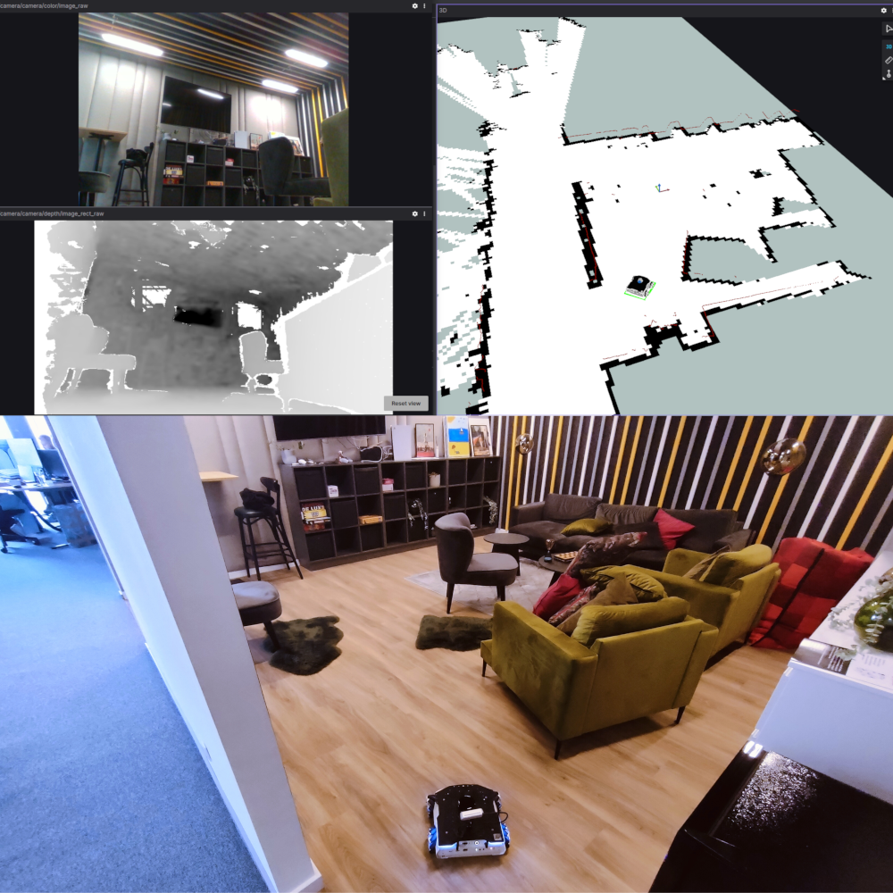

# Autonomous Mobile Robot Demo

This project demonstrates the use of [RAI](https://github.com/RobotecAI/rai) framework interfacing with a robot. In particular, it shows the communication between Generative AI models and the [Husarion ROSbot XL](https://husarion.com/manuals/rosbot-xl/) - an autonomous mobile robot platform developed by [Husarion](https://husarion.com). 

The demo can be successfully run on any robot equipped with the same set of sensors and controlled using ROS 2 messaging protocols. Additionally, the same behavior can be reproduced in the simulation developed using [O3DE](https://www.o3de.org/) game engine. 

> **_NOTE:_**  This repository is not yet functional, as the demo is undergoing an internal review and development. The code will be fully usable and documented before [ROSCon 2024](https://roscon.ros.org/2024/).

## Demo description

The robot equipped with a microphone can listen to the commands and react accordingly. The demo is limited by the current Generative AI models linked via RAI framework and the robot's sensors. A simple proof-of-concept implementation shows, that robot can move through the room and describe what it sees.

This demo is designed to drive a real robot, but the simulation based on the [RobotVacuumSample demo](https://github.com/o3de/RobotVacuumSample) is provided for quick tests.

### Screenshots



A sample setup with a Husarion ROSBot XL robot entering the room. 
Top left: color and depth images seen by the robot;
Top right: map constructed by the robot based on lidar data;
Bottom: photo of the robot entering the scene.


Simulation environment using O3DE.

## Starting guide

### Real robot configuration

> **_NOTE:_** This section will be added in the final version of this document.

### Simulation environment configuration

The simulation environment from [RobotVacuumSample demo](https://github.com/o3de/RobotVacuumSample) is used in this demo. The primary difference lies in the default robot model available. Specifically, the original repository utilized a vacuum cleaner model as its default robot, whereas the current repository has been configured to utilize [Husarion ROSbot XL](https://husarion.com/manuals/rosbot-xl/). A script that pulls the base repository as a submodule and applies a corresponding _Git patch_ is available on the repository. 

> **_NOTE:_** Project folder in this repository, which is a git submodule, will be set in a *dirty* git state due to changes applied by the patch.

The project was tested on Ubuntu 22.04 with ROS 2 Humble and Ubuntu 24.04 with ROS 2 Jazzy. Windows platform is not supported. 

Please follow the instructions below to build the project. The instructions are based on a common base folder: $DEMO_BASE (absolute path). Install [ROS 2 first](https://docs.ros.org/en/humble/Installation/Ubuntu-Install-Debians.html) and `git-lfs` package to pull the binary files.

1. Install `git-lfs` package and pull the codebase.
```bash
sudo apt-get install git-lfs
cd $DEMO_BASE
git clone https://github.com/RobotecAI/rai-rosbot-xl-demo.git
cd $DEMO_BASE/rai-rosbot-xl-demo
./setup_submodules.bash
```

2. Clone O3DE and register the engine

```bash
cd $DEMO_BASE
git clone https://github.com/o3de/o3de.git -b stabilization/2409
cd $DEMO_BASE/o3de
git lfs install
git lfs pull
python/get_python.sh
scripts/o3de.sh register --this-engine
```

3. Clone and register the ROS2 Gem locally; register the RosRobotSample Gem locally

```bash
cd $DEMO_BASE
git clone https://github.com/o3de/o3de-extras.git -b stabilization/2409
$DEMO_BASE/o3de/scripts/o3de.sh register -gp $DEMO_BASE/o3de-extras/Gems/ROS2
$DEMO_BASE/o3de/scripts/o3de.sh register -gp $DEMO_BASE/o3de-extras/Gems/RosRobotSample
```

4. Clone and register the Loft Scene project locally

```bash
cd $DEMO_BASE
git clone https://github.com/o3de/loft-arch-vis-sample.git -b main
cd $DEMO_BASE/loft-arch-vis-sample
git lfs install
git lfs pull
$DEMO_BASE/o3de/scripts/o3de.sh register -gp $DEMO_BASE/loft-arch-vis-sample/Gems/ArchVis
```

### Building

You can build the simulation in:
- development build, or
- release build.

**Development build** is tied with the local assets and is focused on development.

**Release build** creates a bundled and portable version of the simulation that can be moved between PCs.

### Development build

1. Build development build

```bash
cd $DEMO_BASE/rai-rosbot-xl-demo/Project
cmake -B build/linux -G "Ninja Multi-Config" -DLY_STRIP_DEBUG_SYMBOLS=TRUE -DLY_DISABLE_TEST_MODULES=ON
cmake --build build/linux --config profile --target RAIROSBotXLDemo.Assets RAIROSBotXLDemo.GameLauncher
```

2. Run simulation

```bash
$DEMO_BASE/rai-rosbot-xl-demo/Project/build/linux/bin/profile/RAIROSBotXLDemo.GameLauncher -bg_ConnectToAssetProcessor=0
```

### Release build

1. Build required tools and assets
```bash
cd $DEMO_BASE/rai-rosbot-xl-demo/Project
cmake -B build/linux -S . -G "Ninja Multi-Config" -DLY_DISABLE_TEST_MODULES=ON -DLY_STRIP_DEBUG_SYMBOLS=ON
cmake --build build/linux --target AssetBundlerBatch RAIROSBotXLDemo.Assets --config profile
```

2. Build executable
```bash
cd $DEMO_BASE/rai-rosbot-xl-demo/Project
cmake -B build/linux_mono -S . -G "Ninja Multi-Config" -DLY_DISABLE_TEST_MODULES=ON -DLY_STRIP_DEBUG_SYMBOLS=ON -DLY_MONOLITHIC_GAME=1
cmake --build build/linux_mono --target RAIROSBotXLDemo.GameLauncher --config profile
```

3. Prepare engine asset bundle
```bash
cd $DEMO_BASE/rai-rosbot-xl-demo/Project

# Prepare engine seed list
./build/linux/bin/profile/AssetBundlerBatch assetLists --assetListFile $(pwd)/AssetBundling/AssetLists/engine_linux.assetlist --platform linux --project-path $(pwd) --allowOverwrites --addDefaultSeedListFiles

# Build engine asset bundle
./build/linux/bin/profile/AssetBundlerBatch bundles --maxSize 2048 --platform linux --project-path $(pwd) --allowOverwrites --outputBundlePath $(pwd)/AssetBundling/Bundles/engine_linux.pak --assetListFile $(pwd)/AssetBundling/AssetLists/engine_linux.assetlist
```

3. Prepare simulation asset bundle
```bash
cd $DEMO_BASE/rai-rosbot-xl-demo/Project

# Create seed list
./build/linux/bin/profile/AssetBundlerBatch seeds --seedListFile $(pwd)/AssetBundling/SeedLists/husarion.seed --addSeed $(pwd)/Cache/linux/levels/loft/loft.spawnable

# Prepare simulation seed list
./build/linux/bin/profile/AssetBundlerBatch assetLists --assetListFile $(pwd)/AssetBundling/AssetLists/game_linux.assetlist --platform linux --project-path $(pwd) --allowOverwrites --seedListFile $(pwd)/AssetBundling/SeedLists/husarion.seed

# Build simulation asset bundle
./build/linux/bin/profile/AssetBundlerBatch bundles --maxSize 2048 --platform linux --project-path $(pwd) --allowOverwrites --outputBundlePath $(pwd)/AssetBundling/Bundles/game_linux.pak --assetListFile $(pwd)/AssetBundling/AssetLists/game_linux.assetlist
```

4. Prepare bundle release
```bash
cd $DEMO_BASE/rai-rosbot-xl-demo
mkdir -p release/Cache/linux
cp $DEMO_BASE/rai-rosbot-xl-demo/Project/AssetBundling/Bundles/* ./release/Cache/linux
cp $DEMO_BASE/rai-rosbot-xl-demo/Project/build/linux_mono/bin/profile/* ./release
```

5. Run the simulation
```bash
$DEMO_BASE/rai-rosbot-xl-demo/release/RAIROSBotXLDemo.GameLauncher -bg_ConnectToAssetProcessor=0
```

### Running the simulation and navigation stack

Scripts for starting the simulation and navigation stack are added to this repository:
1. `run-game.bash`: a bash script starting the game (development build).
2. `run-game-bundled.bash`: a bash script starting the game (release build).
3. `run-nav.bash`: a bash script starting the navigation stack.
4. `run-rviz.bash`: a bash script starting RViz software to interface the navigation. 

First, start the simulation with `run-game.bash` or `run-game-bundled.bash` (depending on your build type), and then start `run-nav.bash` and `run-rviz.bash` in separate shells and give the navigation goal in RViz window.
 